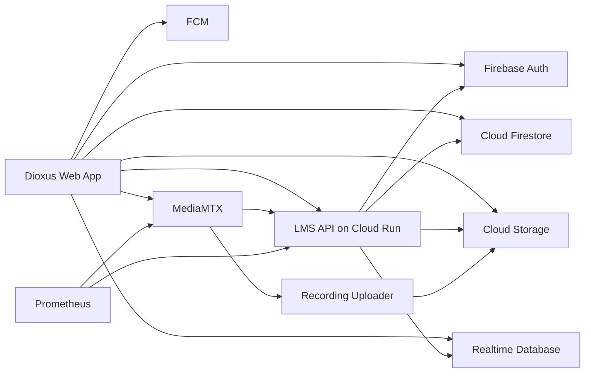
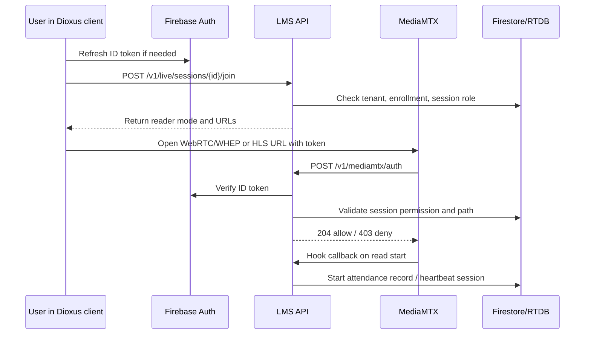
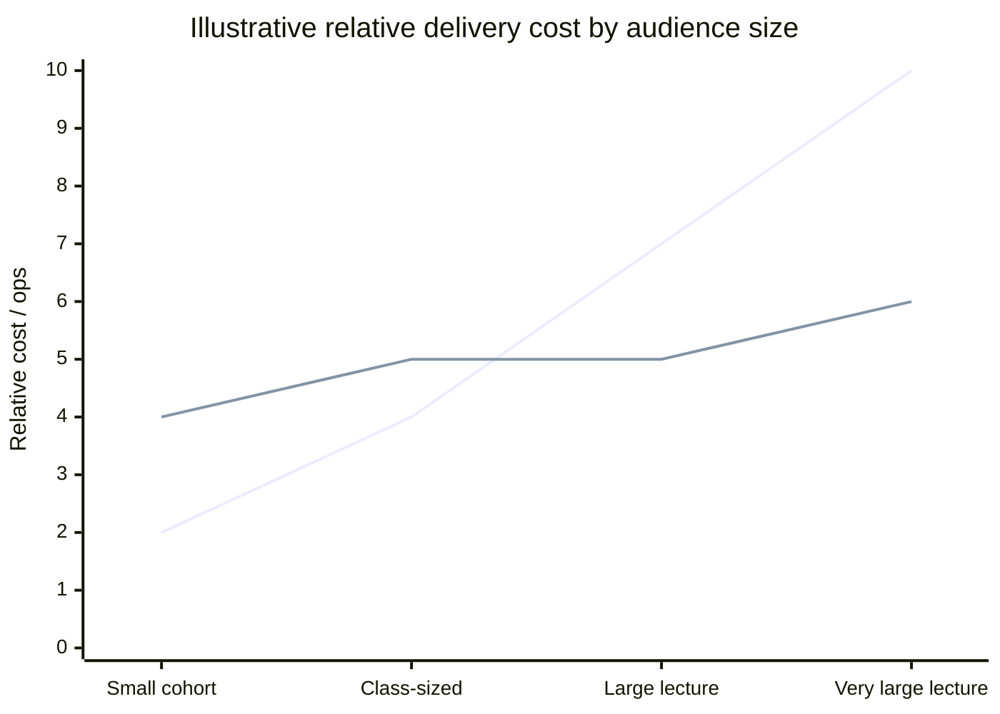

# Final PRD for a Lightweight LMS on Firebase and MediaMTX

## Executive summary

This PRD recommends a **web-first, production-ready LMS** that keeps the backend intentionally small by using **Firebase Auth** for identity, **Cloud Firestore** for durable application data, **Cloud Storage for Firebase** for uploaded files, and **Realtime Database** only for presence and ephemeral session state. The live-class stack uses **self-hosted MediaMTX** as the media router for low-latency delivery, recording, protocol conversion, and observability, with a thin API/auth layer on **Cloud Run**. This is the cleanest way to satisfy the product goals of light operations, efficient backend design, strong RBAC, live classes, and a future path to desktop packaging without building a large monolith. Firebase’s strengths here are tightly integrated auth/security rules, managed realtime data services, and a pay-for-usage model in Firestore and Cloud Run; MediaMTX’s strengths are protocol breadth, zero-dependency deployment, HTTP/JWT authentication hooks, recording/playback, and Prometheus-compatible metrics. citeturn6view10turn12search3turn6view13turn31view3turn6view17turn7view1turn6view4

The central architectural recommendation is: **keep Firebase as the system of record for product data and authorization context, and keep MediaMTX as the media plane only**. In practice, that means course/catalog/enrollment/assignments/grades/live-session metadata live in Firestore; uploads live in Cloud Storage; presence and per-session heartbeats live in Realtime Database; and MediaMTX handles publish/read/record/playback for live streams. A small backend on Cloud Run verifies Firebase tokens, applies RBAC, serves operational APIs, and responds to MediaMTX auth and hook callbacks. This split respects Firebase’s document-oriented design, avoids pushing binary or high-churn ephemeral state into Firestore, and gives MediaMTX a narrow, observable role. citeturn18view2turn22view2turn22view3turn22view4turn35view2turn24view3

For **live classes**, the recommended production posture is **HTTP auth in MVP**, then **dedicated media JWTs in v1 or v2** once auth QPS or session scale justifies it. MediaMTX supports internal, external HTTP, and JWT-based authentication; its JWT mode is explicitly more performant because it validates against a JWKS endpoint rather than calling an external service on every request. Firebase ID tokens are short-lived and verifiable with the Admin SDK, so they fit cleanly into the MVP auth gateway. For larger scale, a media-token service can mint short-lived JWTs carrying `mediamtx_permissions`, which MediaMTX natively expects. citeturn7view1turn7view4turn6view11turn6view12

For the frontend, the recommendation is **Dioxus web first**, with a **Dioxus design system** built on HTML/CSS, CSS variables, and optional Tailwind utility classes. Dioxus is a good fit because it targets the web via WASM, supports routing/signals/fullstack patterns, and uses standard HTML/CSS rather than inventing a custom styling model. Desktop packaging should remain **optional**, with **Tauri** used only if institutional desktop distribution becomes a real requirement; otherwise a polished PWA is the lighter operational choice. citeturn20view0turn20view5turn20view6turn20view1turn10search4turn36view1turn36view2

The final product direction is therefore:

| Layer | Recommended choice | Why |
|---|---|---|
| Client UI | Dioxus web app | Web-first, shared UI system, standard HTML/CSS, WASM target |
| Auth | Firebase Auth | Mature auth, custom claims, server verification, optional session cookies |
| Primary data | Cloud Firestore | Flexible document model, good fit for LMS metadata and memberships |
| Presence / ephemeral state | Realtime Database | Native connection state and `onDisconnect` support |
| Files | Cloud Storage for Firebase | Secure uploads, rules-based path control |
| Notifications | Firebase Cloud Messaging | Reliable push and data messaging |
| API / operational backend | Go on Cloud Run | Small binary, concurrency-friendly, low ops |
| Alternative backend language | TypeScript on Cloud Run | Faster team onboarding if Node/Firebase ecosystem bias |
| Live media | MediaMTX on a VM / container host | Purpose-built media router with WebRTC/HLS/RTMP/RTSP support |
| Metrics | Prometheus scraping MediaMTX and API | Native match for MediaMTX metrics |
| Optional desktop packaging | Tauri wrapper around web build | Only if desktop install/distribution is required |

The table above is a synthesized recommendation from the official capabilities and constraints of Firebase, Cloud Run, Dioxus, Tauri, Prometheus, and MediaMTX. citeturn22view5turn18view2turn22view3turn14search0turn22view10turn31view0turn31view3turn24view3turn20view0turn20view5turn36view1turn22view13

## Product definition

The product is a **lightweight LMS for cohorts, training teams, independent academies, and internal education programs**. It should support course authoring, enrollments, lessons, assignments, grading, notifications, file uploads, search, and live classes, while avoiding heavyweight SIS/ERP scope. The boundary of the product should stay intentionally narrow: **learning delivery, lightweight administration, and live teaching** rather than deep registrar, tuition, or accreditation workflows. That constraint is important because Firestore is optimized for “large collections of small documents,” and Cloud Firestore documents have a 1 MiB size limit; a successful design should therefore bias toward modular records, not giant all-in-one course or user documents. citeturn18view2turn18view1

The product goals are:

- **Fast setup for a new tenant** with branded login, roles, and course structure.
- **Low-ops delivery** by offloading identity, core storage, and push messaging to Firebase.
- **Interactive live teaching** with an architecture that can start simple and scale up for larger lecture audiences.
- **Strict tenant and role isolation** using Firebase custom claims, security rules, and backend-verified authorization.
- **Extensibility without backend bloat**, especially for search, notifications, recordings, and app packaging. citeturn6view10turn22view8turn24view3

The recommended target users and roles are:

| User type | Main jobs to be done | Primary surfaces |
|---|---|---|
| Student | Browse course, attend class, submit work, track progress | Dashboard, course page, lesson page, live room |
| Instructor | Build course, schedule sessions, teach live, grade work | Course studio, class console, grading inbox |
| TA | Moderate live session, monitor attendance, assist grading | Live moderation panel, attendance panel, grading support |
| Course admin | Manage instructors, enrollment windows, course settings | Course settings, roster, communications |
| Org admin | Manage tenant, branding, policies, users, billing-adjacent ops | Tenant admin, user admin, analytics, security |
| Support / super admin | Internal support and break-glass access | Restricted admin console with audit trail |

This role model aligns with Firebase’s documented RBAC primitives: custom claims for coarse-grained access decisions and security rules that can enforce authorization on client-originated data access. citeturn6view10turn22view0

The core feature set should be staged like this:

| Capability | MVP | v1 | v2 |
|---|---|---|---|
| Course catalog and enrollment | Yes | Yes | Yes |
| Lessons and content blocks | Yes | Yes | Yes |
| Assignments and submissions | Yes | Yes | Yes |
| Instructor grading and feedback | Yes | Yes | Yes |
| Live class lecture mode | Yes | Yes | Yes |
| Student presentation / stage handoff | Light | Yes | Yes |
| TA moderation controls | Light | Yes | Yes |
| File uploads and downloadable assets | Yes | Yes | Yes |
| Push notifications | Basic | Yes | Yes |
| Search | Structured search only | Full-text | Semantic / vector adjunct |
| Recording playback | Optional | Yes | Yes |
| Quiz engine / question bank | No | Optional | Yes |
| LTI / SCORM | No | No | Optional |
| Mobile native packaging | No | Optional | Optional |

The search recommendation deserves an explicit design choice. **MVP search** should use Firestore indexes and structured queries for titles, tags, instructors, status, and enrollment filters. If full text becomes necessary, there are two official paths: **Firestore Enterprise text search**, which requires a Firestore Enterprise database, or a **Firebase extension that syncs Firestore into Algolia**, which adds Cloud Functions and third-party search cost. For a lightweight LMS, the best sequence is structured search in MVP, then Algolia-backed full text in v1 if search quality becomes a differentiator, while keeping Firestore Enterprise search as an alternative for organizations that want fewer third-party dependencies. citeturn22view15turn23view0turn11search5turn11search13

## Roles, RBAC, and security model

The RBAC model should be **two-layered**:

1. **Coarse-grained, tenant-wide entitlements** in Firebase custom claims.
2. **Fine-grained, resource-scoped permissions** in Firestore membership records, checked by backend APIs and referenced sparingly from security rules.

That split is not just a style choice; it follows Firebase’s documented constraints. Custom claims are meant for access control, must be set from a privileged environment, propagate through ID tokens, and are limited to **1000 bytes**, so they should not be used to store large per-course permission maps. citeturn32view2turn32view1

The recommended custom claims shape is:

```json
{
  "tenantId": "t_acme",
  "roles": ["student"],
  "orgAdmin": false,
  "claimsVersion": 3,
  "mfa": true
}
```

For an instructor or admin, the token might look like:

```json
{
  "tenantId": "t_acme",
  "roles": ["instructor", "course_admin"],
  "orgAdmin": true,
  "claimsVersion": 9,
  "mfa": true
}
```

This is the right level of information for the token because Firebase explicitly recommends using custom claims only for access control data and storing all other details elsewhere. citeturn32view2

The recommended permission model is:

| Permission surface | Student | Instructor | TA | Course admin | Org admin |
|---|---:|---:|---:|---:|---:|
| Read own enrolled courses | Yes | Yes | Yes | Yes | Yes |
| Create/edit course | No | Scoped | No | Scoped | Yes |
| Publish lesson content | No | Scoped | No | Scoped | Yes |
| Enroll / remove students | No | No | No | Scoped | Yes |
| Grade assignments | Own submissions only | Scoped | Scoped | Scoped | Yes |
| Start lecture stream | No | Yes | Backup only | Scoped | Yes |
| Moderate chat / stage | No | Limited | Yes | Yes | Yes |
| Access attendance exports | No | Scoped | Scoped | Yes | Yes |
| Manage tenant branding / policies | No | No | No | No | Yes |

The backend should treat **roles** as a starting point and never as the whole answer. Course-level authority should come from resource membership documents such as `course_memberships/{courseId_uid}` and `session_roles/{sessionId_uid}`. citeturn22view2turn18view2

A sample security-rules strategy for Firestore should look like this conceptually:

```javascript
rules_version = '2';
service cloud.firestore {
  match /databases/{database}/documents {
    function signedIn() {
      return request.auth != null;
    }

    function sameTenant(tid) {
      return signedIn() && request.auth.token.tenantId == tid;
    }

    function hasRole(role) {
      return signedIn() && role in request.auth.token.roles;
    }

    function isCourseMember(courseId) {
      return exists(
        /databases/$(database)/documents/course_memberships/$(courseId + "_" + request.auth.uid)
      );
    }

    match /courses/{courseId} {
      allow read: if signedIn() && isCourseMember(courseId);
      allow write: if hasRole("course_admin") || hasRole("org_admin");
    }
  }
}
```

This rules approach is viable, but it must remain lean because Firestore security rules have limits on `exists()`, `get()`, and `getAfter()` calls per request. The practical consequence is that membership docs should be denormalized for cheap lookups and sensitive content should be split into dedicated documents instead of hidden by field-level assumptions. Firebase also documents that **reads happen at the document level**, which means a document is either readable or not readable; rules cannot reveal only selected fields inside a readable document. citeturn18view0turn22view1

This leads to three hard security requirements in the product schema:

- **Do not** put staff-only grading notes in the same document that students may read.
- **Do not** put private profile data in the same document as public roster data.
- **Do not** put per-course ACL arrays into custom claims. Keep them in Firestore. citeturn22view1turn32view2

For authentication posture, the recommended baseline is:

- Email/password and Google sign-in for broad compatibility.
- Optional session-cookie exchange for web SSR/admin surfaces.
- **TOTP MFA for admins** if upgrading to Firebase Authentication with Identity Platform.
- App Check on every custom backend and protected Firebase resource. citeturn22view5turn33view0turn22view7turn22view8turn22view9

Firebase documents that ID tokens last about **one hour** and are refreshed via refresh tokens; it also documents server-side session cookies as a valid pattern for HTTP-only admin sessions, with verification and revocation checks available in the Admin SDK. Identity Platform adds MFA, logging, and enterprise support, but also changes pricing. citeturn6view12turn33view0turn34view1turn34view3

## System architecture and data model

The recommended architecture is below. It deliberately separates the **application plane** from the **media plane**.



This split reflects the documented capabilities: Firestore as a document database for application data, Realtime Database for presence, Cloud Storage for uploads, Cloud Run for lightweight HTTP services, and MediaMTX as the media router with hooks, auth, recording, playback, and Prometheus metrics. citeturn18view2turn22view3turn14search0turn31view3turn24view3turn6view4

The backend recommendation is **Go on Cloud Run** by default. The rationale is operational rather than ideological: the service is mostly token verification, lightweight business rules, Firestore access, MediaMTX auth callbacks, and webhook ingestion, all of which fit Cloud Run’s request/concurrency model. Cloud Run pricing is pay-for-usage, charges only for used resources, and higher concurrency can reduce cost if the service is written to handle parallel I/O well. TypeScript on Cloud Run is a sound alternative when team familiarity with the Firebase/Node ecosystem is more important than runtime footprint. citeturn31view3turn31view0turn31view1turn22view11

The Firestore model should keep documents small, queryable, and tenant-safe. A proposed schema is:

```text
tenants/{tenantId}
users/{uid}
tenant_memberships/{tenantId_uid}
courses/{courseId}
courses/{courseId}/modules/{moduleId}
courses/{courseId}/lessons/{lessonId}
course_memberships/{courseId_uid}
assignments/{assignmentId}
submissions/{submissionId}
live_sessions/{sessionId}
session_roles/{sessionId_uid}
attendance/{sessionId_uid}
notifications/{notificationId}
user_notifications/{uid}/items/{itemId}
file_assets/{assetId}
recordings/{recordingId}
recording_segments/{segmentId}
audit_events/{eventId}
```

This structure follows Firebase’s documented advice to choose among documents, multiple collections, and subcollections based on query needs; for the LMS, the right pattern is a mix: subcollections for bounded hierarchies like course modules/lessons, and top-level collections for cross-course queries like assignments, submissions, live sessions, and attendance. citeturn22view2turn18view2

Representative document shapes should be:

```json
// courses/{courseId}
{
  "tenantId": "t_acme",
  "title": "Intro to Product Strategy",
  "slug": "intro-product-strategy",
  "status": "published",
  "visibility": "private",
  "ownerUid": "u_123",
  "instructorUids": ["u_123"],
  "coverAssetId": "fa_01",
  "tags": ["product", "strategy"],
  "searchTerms": ["intro", "product", "strategy"],
  "createdAt": "...",
  "updatedAt": "..."
}
```

```json
// lessons/{lessonId}
{
  "tenantId": "t_acme",
  "courseId": "c_01",
  "moduleId": "m_01",
  "type": "video|rich_text|live_session|file_bundle",
  "title": "Week 1 Lecture",
  "sortOrder": 10,
  "body": "...",
  "videoAssetId": "fa_99",
  "liveSessionId": "ls_05",
  "publishedAt": "...",
  "updatedAt": "..."
}
```

```json
// live_sessions/{sessionId}
{
  "tenantId": "t_acme",
  "courseId": "c_01",
  "title": "Week 1 Live Class",
  "status": "scheduled|live|ended",
  "startsAt": "...",
  "endsAt": "...",
  "primaryInstructorUid": "u_123",
  "taUids": ["u_124"],
  "mode": "lecture",
  "mainPath": "live/t_acme/c_01/ls_05/main",
  "screenPath": "live/t_acme/c_01/ls_05/screen",
  "stagePrefix": "live/t_acme/c_01/ls_05/stage/",
  "recordingEnabled": true,
  "hlsFallbackEnabled": true
}
```

```json
// course_memberships/{courseId_uid}
{
  "tenantId": "t_acme",
  "courseId": "c_01",
  "uid": "u_555",
  "role": "student|instructor|ta|course_admin",
  "status": "active|invited|suspended",
  "joinedAt": "...",
  "updatedAt": "..."
}
```

```json
// submissions/{submissionId}
{
  "tenantId": "t_acme",
  "assignmentId": "a_09",
  "courseId": "c_01",
  "uid": "u_555",
  "status": "draft|submitted|returned|graded",
  "textAnswer": "...",
  "assetIds": ["fa_sub_1"],
  "submittedAt": "...",
  "grade": 87,
  "gradedByUid": "u_123",
  "gradedAt": "...",
  "studentVisibleFeedback": "...",
  "staffPrivateNotesRef": "submission_private/sp_09"
}
```

```json
// file_assets/{assetId}
{
  "tenantId": "t_acme",
  "ownerUid": "u_555",
  "bucketPath": "tenants/t_acme/courses/c_01/assets/fa_01.pdf",
  "contentType": "application/pdf",
  "sizeBytes": 482119,
  "visibility": "private|course|public",
  "createdAt": "...",
  "linkedTo": {
    "entityType": "lesson",
    "entityId": "l_01"
  }
}
```

These shapes are aligned with Firestore’s document model and Cloud Storage’s path-based authorization model. They also intentionally keep large binaries out of Firestore, which fits both the “small documents” guidance and the hard document-size limit. citeturn18view2turn18view1turn35view2

The correct use of **Realtime Database** in this architecture is narrow but important. Firestore does not natively support presence, while Realtime Database provides connection-state primitives such as `/.info/connected` and server-side `onDisconnect()` behavior. Therefore RTDB should be used for `session_presence/{sessionId}/{uid}`, temporary hand-raise queues, live heartbeat timestamps, and similar ephemeral state, with durable attendance summaries mirrored into Firestore after session end. citeturn22view3turn22view4

The principal API surface should be concise:

| Endpoint | Purpose |
|---|---|
| `POST /v1/session/login/exchange` | Optional Firebase ID token → HTTP-only session cookie |
| `GET /v1/me` | Resolved identity, tenant, roles, memberships |
| `GET /v1/courses` | Tenant-safe course listing with filters |
| `POST /v1/courses/{id}/enroll` | Enrollment / invitation |
| `POST /v1/assignments/{id}/submissions` | Create or finalize submission metadata |
| `POST /v1/live/sessions` | Create/schedule live session |
| `POST /v1/live/sessions/{id}/join` | Join flow, returns reader URLs and mode |
| `POST /v1/live/sessions/{id}/present` | Request publish/stage rights |
| `POST /v1/live/sessions/{id}/publish-token` | Optional media-JWT minting endpoint |
| `POST /v1/mediamtx/auth` | MediaMTX external HTTP auth callback |
| `POST /v1/mediamtx/events/*` | Event ingestion from MediaMTX hooks |
| `GET /v1/live/sessions/{id}/attendance` | Attendance summary/export |
| `POST /v1/notifications/test` | Operational notification testing |

## Live class and video infrastructure

MediaMTX is the right fit for this product when the live-class design is treated as a **managed stage/router problem**, not a full Zoom-style MCU problem. The official MediaMTX docs emphasize publishing, reading, protocol conversion, routing by path, recording/playback, forwarding, hooks, auth, metrics, and control APIs. They do **not** document a full multi-party meeting UI layer or server-side compositing workflow, so the product should be designed around **one primary published classroom stream**, plus controlled alternate publish slots for presentations, TA takeover, and screen-sharing. That makes the system simpler, more reliable, and much closer to MediaMTX’s documented strengths. citeturn24view3turn6view19

The live-class modes should be:

| Mode | Publish pattern | Read pattern | Best use | Tradeoff |
|---|---|---|---|---|
| Lecture streaming MVP | Instructor publishes `main` path | Students watch WebRTC first; HLS fallback if needed | Standard live lecture | One active stage by default |
| Student presentation | Student gets temporary publish lease to `stage/{uid}` or promoted `main` | Class still watches primary stage | Presentations, demos, oral assessments | Needs moderator handoff |
| TA mode | TA can publish backup stream or take over main stage | Students continue on same class room | Backup host, troubleshooting, co-teaching | Requires explicit role controls |
| Screen share | Instructor or presenter swaps camera to screen, or uses dedicated `screen` path | Same room UI chooses current source | Slide teaching, coding demos | Composite layouts are not an MVP feature |

Protocol support, WHIP/WHEP URL shapes, OBS support, hooks, recording, and HLS/CDN constraints in the following design come directly from the official MediaMTX publish/read/auth/record/scalability documentation. citeturn27view0turn27view1turn27view2turn7view1turn25view1turn24view0

The recommended path convention is:

```text
live/{tenantId}/{courseId}/{sessionId}/main
live/{tenantId}/{courseId}/{sessionId}/screen
live/{tenantId}/{courseId}/{sessionId}/stage/{uid}
live/{tenantId}/{courseId}/{sessionId}/backup/{uid}
```

This convention matters because MediaMTX permissions are path-oriented, and both HTTP auth and JWT auth operate on action/path pairs. citeturn7view0turn7view4

The join-and-auth flow should look like this:



MediaMTX documents the exact HTTP-auth payload it sends to an external auth server: `user`, `password`, `token`, `ip`, `action`, `path`, `protocol`, `id`, and `query`. It also documents that JWT-based auth validates against a JWKS endpoint and expects a permission claim such as `mediamtx_permissions`. citeturn7view1turn7view4

### MediaMTX auth flow and token lifecycle

For **MVP**, the recommended auth choice is:

- `authMethod: http`
- Client passes a fresh **Firebase ID token**
- API verifies token with Firebase Admin SDK
- API checks the user’s role and session membership in Firestore
- API returns 20x to allow or 403 to deny

This is the most practical MVP because Firebase ID tokens are already part of the app’s identity flow, are verifiable server-side, and last about one hour. The frontend should refresh the ID token immediately before join, publish, or reconnect. citeturn7view1turn6view11turn6view12

For **scale-up**, the recommended v1/v2 auth choice is:

- Keep app identity in Firebase
- Mint a **short-lived media JWT** from the backend after verifying the Firebase user
- Put `mediamtx_permissions` or a configured equivalent claim in that media JWT
- Configure MediaMTX `authMethod: jwt` and `authJWTJWKS`
- Use very short TTLs for publish rights and modest TTLs for read rights

This is advisable later because MediaMTX’s JWT mode is explicitly more performant than HTTP auth since the identity server is contacted once for key retrieval rather than on every auth request. citeturn7view1turn7view4

The token lifecycle should therefore be:

| Token | Issuer | TTL posture | Used for |
|---|---|---|---|
| Firebase ID token | Firebase | About 1 hour | App API auth, MVP media auth |
| Firebase refresh token | Firebase | Long-lived until revoked / major account event | Client token refresh |
| Firebase session cookie | Backend via Admin SDK | Short admin sessions, up to 2 weeks max | Web SSR/admin console |
| Media JWT | LMS API | Publish: 2–5 minutes; Read: 15–30 minutes | Scale-optimized MediaMTX JWT auth |

The Firebase parts of this lifecycle are documented; the exact media-JWT durations are a product recommendation, not a vendor requirement. citeturn6view12turn33view0

A production-minded MediaMTX config skeleton should be:

```yaml
authMethod: http
authHTTPAddress: https://api.example.com/v1/mediamtx/auth

metrics: yes
api: yes
playback: yes

webrtc: true
webrtcEncryption: true
webrtcAdditionalHosts: [media.example.com]
webrtcICEServers2:
  - url: stun:stun.l.google.com:19302

hls: true
hlsEncryption: true
hlsVariant: lowLatency

pathDefaults:
  record: yes
  recordPath: ./recordings/%path/%Y-%m-%d_%H-%M-%S-%f
  recordFormat: fmp4
  recordPartDuration: 1s
  recordSegmentDuration: 1h
  recordDeleteAfter: 30d

  runOnRead: >
    curl -fsS "https://api.example.com/v1/mediamtx/events/read-start?path=$MTX_PATH&reader=$MTX_READER_ID&type=$MTX_READER_TYPE&query=$MTX_QUERY"

  runOnUnread: >
    curl -fsS "https://api.example.com/v1/mediamtx/events/read-stop?path=$MTX_PATH&reader=$MTX_READER_ID&type=$MTX_READER_TYPE&query=$MTX_QUERY"

  runOnReady: >
    curl -fsS "https://api.example.com/v1/mediamtx/events/stream-ready?path=$MTX_PATH&source_id=$MTX_SOURCE_ID&source_type=$MTX_SOURCE_TYPE"

  runOnNotReady: >
    curl -fsS "https://api.example.com/v1/mediamtx/events/stream-stop?path=$MTX_PATH&source_id=$MTX_SOURCE_ID&source_type=$MTX_SOURCE_TYPE"

  runOnRecordSegmentComplete: >
    curl -fsS "https://api.example.com/v1/mediamtx/events/record-complete?path=$MTX_PATH&segment=$MTX_SEGMENT_PATH&duration=$MTX_SEGMENT_DURATION"
```

The fields in this config are drawn from MediaMTX’s documented authentication, hooks, recording, metrics, playback, HLS, and WebRTC settings. citeturn7view1turn5search1turn25view1turn30view3turn6view4

A sample **MediaMTX HTTP auth request body** handled by the backend is:

```json
{
  "user": "",
  "password": "",
  "token": "eyJhbGciOiJSUzI1NiIsImtpZCI6Ij...firebase-id-token...",
  "ip": "203.0.113.5",
  "action": "read",
  "path": "live/t_acme/c_01/ls_05/main",
  "protocol": "webrtc",
  "id": "reader-abc123",
  "query": "role=student&session=ls_05"
}
```

MediaMTX documents this payload shape exactly. The backend should return `204 No Content` for allow, `403` for deny, and `401` only where a protocol expects a challenge/retry pattern. citeturn7view1

A sample **media JWT claim** for scale mode is:

```json
{
  "sub": "u_555",
  "tenantId": "t_acme",
  "sessionId": "ls_05",
  "mediamtx_permissions": [
    { "action": "read", "path": "live/t_acme/c_01/ls_05/main" }
  ],
  "exp": 1770000000
}
```

This follows MediaMTX’s documented JWT expectation for `mediamtx_permissions`. citeturn7view4

### Publishing, reading, and protocol choices

The protocol recommendation is:

| Use case | Recommended protocol | Why |
|---|---|---|
| Browser instructor publish | WebRTC publish page or WHIP | Lowest-friction interactive publish |
| OBS instructor publish | WHIP first, RTMP second | WHIP is modern and low-latency; RTMP remains widely familiar |
| Browser student playback | WebRTC first | Lowest-latency classroom experience |
| Large one-to-many audience | HLS fallback | Cacheable through CDN, better scale |
| Programmatic egress / QA | WHEP | URL-based WebRTC read for tooling |
| Legacy encoder compatibility | RTMP | Useful for OBS and existing encoders |

MediaMTX documents browser publish via `/publish`, WHIP publish via `/whip`, browser read at the stream path itself, and WHEP read via `/whep`. It also documents that OBS can publish via WHIP, including simulcast/multitrack behavior, and that browser codec compatibility is uneven; for widest browser support, H.264 baseline and Opus are the safest defaults. citeturn27view0turn27view1turn27view2turn27view4

A join response from the LMS API should therefore look like:

```json
{
  "sessionId": "ls_05",
  "mode": "webrtc",
  "viewer": {
    "webrtcUrl": "https://media.example.com/live/t_acme/c_01/ls_05/main",
    "whepUrl": "https://media.example.com/live/t_acme/c_01/ls_05/main/whep",
    "hlsUrl": "https://media.example.com/live/t_acme/c_01/ls_05/main/"
  },
  "fallbackOrder": ["webrtc", "hls"],
  "attendanceHeartbeatSec": 30
}
```

For publish, the response should return the permitted path and protocol options:

```json
{
  "sessionId": "ls_05",
  "publishRole": "instructor",
  "mainPath": "live/t_acme/c_01/ls_05/main",
  "options": {
    "browserPublishUrl": "https://media.example.com/live/t_acme/c_01/ls_05/main/publish",
    "whipUrl": "https://media.example.com/live/t_acme/c_01/ls_05/main/whip",
    "rtmpUrl": "rtmp://media.example.com/live/t_acme/c_01/ls_05/main?token=..."
  }
}
```

### Recording, storage pipeline, and attendance

MediaMTX natively supports recording to disk in **fMP4** or **MPEG-TS**, with configurable segment path, part duration, segment duration, and auto-deletion. It also documents a remote-upload pattern using `rclone` triggered by `runOnInit` and `runOnRecordSegmentComplete`. citeturn25view1turn24view4

The recommended recording pipeline is:

1. MediaMTX records locally in **fMP4**.
2. Each completed segment triggers `runOnRecordSegmentComplete`.
3. A lightweight uploader moves or syncs the segment into object storage.
4. The backend writes `recording_segments` metadata to Firestore.
5. For playback, either:
   - expose MediaMTX playback endpoints, or
   - provide an LMS playback page using the stored playback URLs.

MediaMTX also documents a dedicated playback server with `/list` and `/get` endpoints for recorded timespans and downloadable playback URLs. citeturn30view0turn30view3

The recommended attendance model is **hybrid**:

- MediaMTX `runOnRead` and `runOnUnread` mark stream-level join/leave.
- RTDB heartbeats and `onDisconnect()` provide user/session liveness.
- The LMS API reconciles both into durable Firestore attendance minutes.

This avoids over-trusting a single signal. Firestore alone is a poor fit for presence; RTDB is the right substrate for heartbeat/disconnect semantics. citeturn5search1turn22view4turn22view3

### Reconnection, latency, quality, and scaling

The reconnect ladder should be:

1. Retry WebRTC with same session join context.
2. Refresh Firebase ID token if stale.
3. If WebRTC setup continues to fail, enable TCP WebRTC.
4. Add STUN if NAT traversal is the issue.
5. Add TURN (for example Coturn) if corporate networks block direct paths.
6. Fall back to HLS for passive viewing.

This sequence directly follows MediaMTX’s documented WebRTC connectivity guidance: static UDP, static TCP, STUN/UDP hole punching, then TURN relay. MediaMTX also documents an `AUTH_SECRET` pattern for TURN credentials and provides Coturn setup advice. citeturn28view0turn28view2

The important quality/latency tradeoff is:

- **WebRTC/WHEP** is the interactive, lowest-latency path.
- **HLS** is the scale-out path.
- **CDN fronting MediaMTX is HLS-only**, and low-latency HLS usually must be disabled for cacheability, which increases latency significantly.

MediaMTX’s scalability docs are explicit here: HLS through a CDN scales well, but standard MediaMTX auth no longer applies at the edge and low-latency HLS is not cacheable. citeturn24view0turn24view2

An illustrative scale tradeoff looks like this:



This chart is intentionally illustrative rather than price-quoted; it encodes the documented fact that CDN scaling in MediaMTX is an HLS pattern, not a WebRTC edge-caching pattern. citeturn24view0turn29search2

## Frontend architecture and aesthetics

The frontend should be **Dioxus web first**, with the production app structured around a reusable design system instead of one-off page styling. Dioxus’ value here is practical: it supports the web as a first-class target, exposes browser APIs through WASM-related tooling, offers routing and state primitives, and uses standard HTML/CSS, which makes it easier to build a polished LMS without fighting nonstandard layout systems. Dioxus also supports assets and production optimization directly in its toolchain. citeturn20view5turn20view6turn20view0turn20view1

The recommended frontend package structure is:

```text
app/
  shell/
  router/
  auth/
  firebase_bridge/
  api_client/
  state/
  design_system/
  features/
    courses/
    lessons/
    assignments/
    grading/
    live/
    notifications/
    admin/
```

The critical implementation choice is a **small JS bridge** that exposes the Firebase Web modular SDK to Dioxus. Firebase’s official web guidance recommends the modular API for new apps because it works well with tree-shaking and reduces package size. Dioxus, meanwhile, compiles the web target to WASM and can interoperate with browser APIs; that makes a minimal `wasm-bindgen` bridge a better fit than trying to replace Firebase with an unofficial Rust-native stack. citeturn20view8turn16search0turn20view5

The UI should follow these aesthetic guidelines:

| Area | Design direction |
|---|---|
| Visual tone | Calm, modern academic SaaS; high trust, low clutter |
| Layout | Left navigation + content rail + contextual right drawer for live/grading |
| Typography | Strong hierarchy, large lesson headers, compact table text for admin surfaces |
| Density | Comfortable for learning surfaces, denser for admin and grading surfaces |
| Color system | Neutrals first, one primary accent, one success, one warning, one destructive |
| State design | Progress, due dates, live status, and role state must be visually distinct |
| Motion | Small, purposeful transitions only; no decorative animation during learning |
| Accessibility | Keyboard-first admin flows, clear focus styles, AA contrast minimum |

Because Dioxus uses standard CSS, the best styling implementation is **CSS variables for design tokens** plus either **vanilla CSS modules** or **Tailwind** for high-velocity UI composition. Dioxus officially supports both ordinary CSS and Tailwind-oriented workflows. citeturn20view0turn10search4turn10search12

The live-room UI should be especially deliberate:

- Main stage area for current stream
- Roster / attendance side panel
- Chat / Q&A panel
- “Raise hand” and “Request stage” affordances
- Instructor-only stage controls
- “Switch to low-bandwidth / HLS mode” escape hatch
- Visible recording badge and privacy notice

That UI should feel closer to a teaching console than a generic video meeting app, because the product’s advantage is structured learning context, not just video transport.

For packaging, the recommended order of operations is:

1. **Ship web app + PWA first**
2. **Only add desktop packaging if distribution or offline/local-device features justify it**

Dioxus itself supports desktop rendering via the system WebView and documents very small final app sizes. Tauri also documents tiny, fast binaries and the ability to wrap virtually any frontend framework that compiles to HTML/CSS/JS. The reason to keep this optional is product complexity: packaging is easy to add later, while shipping two or three platform shells too early adds QA and auth/media edge cases. citeturn36view3turn36view1turn36view2

The packaging recommendation is:

| Option | Recommendation | Why |
|---|---|---|
| Dioxus web only | Default | Lowest complexity, best Firebase parity |
| Dioxus desktop renderer | Viable | Small footprint, native Rust, system WebView |
| Tauri wrapper around Dioxus web build | Optional | Good for institutional desktop distribution |
| Separate mobile native app | Defer | Adds cost before product-market fit is proven |

## Operations, cost, testing, and roadmap

The operational deployment should be split by responsibility:

| Component | Hosting recommendation | Notes |
|---|---|---|
| Dioxus web app | Static hosting / CDN | Serve compiled assets close to users |
| LMS API | Cloud Run | Best fit for lightweight HTTP APIs, auth gateway, webhooks |
| MediaMTX | VM or container host with direct TCP/UDP exposure | Better fit than serverless HTTP runtimes |
| TURN | Coturn on VM when needed | Only for hostile NAT/firewall environments |
| Object storage | Cloud Storage for Firebase bucket | For uploads and optionally for processed recordings |
| Metrics | Prometheus | Scrape MediaMTX `/metrics` and API metrics |
| Dashboards | Grafana or equivalent | Optional but recommended |
| Secrets | Secret manager / environment injection | Never hardcode auth keys |

This recommendation comes from combining MediaMTX’s listener and connectivity model with Cloud Run’s HTTP/service concurrency model. MediaMTX exposes dedicated listeners for HLS, WebRTC, RTMP, RTSP, metrics, playback, and more; that profile is naturally VM-oriented, while the application/API/auth plane fits serverless HTTP very well. citeturn29search1turn30view3turn6view4turn31view0turn31view3

Monitoring should be first-class from day one. MediaMTX exposes Prometheus-compatible metrics, and Prometheus is built to scrape HTTP metrics endpoints. The minimum alert set should include:

- no active publisher for a scheduled live session
- spikes in auth denials from `/v1/mediamtx/auth`
- rising `paths_inbound_frames_in_error`
- unusually high reconnect or unread/read churn
- recording-upload lag
- backend 5xx rate
- Firestore / Storage budget thresholds citeturn6view4turn22view13turn22view14

The cost posture should be understood qualitatively rather than over-fitting static numbers. The main billed drivers are:

- **Firestore**: reads, writes, deletes, index reads, storage, bandwidth
- **Cloud Storage**: storage and egress; also note that Cloud Storage for Firebase now requires the Blaze plan
- **Cloud Run**: CPU/memory time and internet egress
- **Identity Platform** if enabled: MAU pricing beyond free tier
- **MediaMTX**: your own VM/bandwidth/storage costs citeturn6view13turn14search1turn14search2turn31view3turn34view1

A few cost conclusions are strong enough to bake into the PRD:

- Keep Firestore documents small and query/index design tight, because Firestore bills reads and index usage. citeturn6view13turn18view2
- Use Realtime Database only for narrow presence use cases, because RTDB billing is bandwidth/download-sensitive and includes protocol/session overhead. citeturn0search12turn22view4
- Put Cloud Run services in the same region as Firestore and Storage where practical, because Cloud Run guidance explicitly notes same-region Google Cloud resource traffic as free. citeturn31view1turn31view3
- For large lecture audiences, HLS + CDN becomes the operational scale path because MediaMTX documents CDN support around HLS, not around WebRTC. citeturn24view0turn29search2
- If you need MFA, audit logs, or SAML/OIDC, budget for Identity Platform rather than assuming base Firebase Auth pricing. citeturn34view1turn34view3

Privacy and security requirements should include:

- TLS everywhere for app and media endpoints.
- App Check verification on all custom backend endpoints.
- Opaque IDs in media paths; no learner names in paths or recording file names.
- Separate documents for student-visible vs staff-private data because Firestore reads are document-level.
- Admin MFA, preferably TOTP when Identity Platform is enabled.
- Recording retention and deletion policy by tenant.
- Explicit consent banner for recorded sessions.
- Audit logging for role changes, grading changes, attendance exports, and recording access. citeturn22view9turn22view1turn22view7turn25view1

The testing plan should cover four layers:

| Test area | What to validate |
|---|---|
| Unit / domain tests | RBAC evaluation, grade calculations, enrollment state transitions |
| Security tests | Firestore rules behavior, tenant isolation, App Check verification, revoked-token handling |
| Integration tests | Join class flow, MediaMTX auth callback, hook ingestion, recording pipeline |
| Interop / load tests | Browser codec matrix, OBS/WHIP publish, reconnection ladder, HLS fallback, attendance correctness |

The roadmap should be:

| Phase | Scope |
|---|---|
| MVP | Auth, course catalog, lessons, enrollments, assignments, grading, files, notifications baseline, lecture-mode live class, RTDB presence, MediaMTX HTTP auth, recording optional |
| v1 | Student presentation mode, TA controls, recording playback, HLS fallback, Algolia or equivalent full-text search, admin analytics, MFA for admins |
| v2 | Media JWT optimization, stage queue UX, richer moderation, processed recordings/transcripts, quizzes/question bank, optional Tauri desktop packaging |

### Open questions and limitations

Some decision points remain intentionally open because the request specified them as open-ended:

- **Expected concurrent viewers per class** is not specified. MediaMTX docs reviewed here do not publish a universal viewer cap, so final scaling thresholds must be established by load testing against your codec ladder, machine size, and whether HLS/CDN is enabled. citeturn24view0turn24view3
- **Recording retention** is not specified. This affects storage cost, compliance posture, and whether you use MediaMTX playback directly or a secondary asset pipeline.
- **Brand and design direction** is not specified beyond “style and aesthetics,” so the aesthetic system in this PRD is a recommended default, not a final brand spec.
- **Search requirements** are not specified deeply enough to decide between structured Firestore search, Firestore Enterprise text search, or Algolia-backed full text without stakeholder input. citeturn22view15turn23view0
- **Identity Platform upgrade** is optional but materially changes capability and pricing; the final choice depends on whether TOTP MFA, SAML/OIDC, enterprise logging, or SLAs are hard requirements. citeturn34view1turn34view3

The most defensible final recommendation is therefore:

- **Ship a Dioxus web LMS with Firebase Auth + Firestore + Storage + RTDB**
- **Use a thin Go API on Cloud Run**
- **Run MediaMTX on a dedicated VM/container host**
- **Start with HTTP auth against Firebase identity**
- **Add media JWTs, HLS/CDN, and richer classroom controls only as real usage demands them**

That gives you a system that is materially lighter than a traditional LMS/video-platform stack, but still production-capable and extensible. citeturn6view17turn7view1turn31view3turn20view0turn20view5